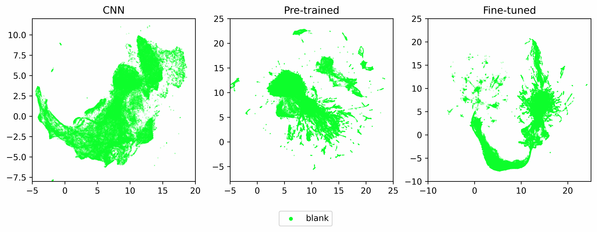

# Wav2vec2Interpretation
Scripts and additional images for article "Investigating wav2vec2 context representations and the effects of fine-tuning, a case-study of a Finnish model"

## Umap visualization of the embeddings

## Visualization of the CNN outputs

You can find the visualizations of the embeddings produced by the CNN component in `pics/cnn_*.svg`

## Visualization of the pretrained Transformer's outputs

You can find the high res visualizations of the embeddings produced by the pre-trained Transformer component in `pics/pre_*.[svg/eps]`

## Visualization of the finetuned Transformer's outputs

You can find the high res visualizations of the embeddings produced by the fine-tuned Finnish Transformer component in `pics/fine_*.[svg/eps]`

## Gender, age and speaker information

Pictures marked with _utt2age_ show how the age information is embedded in the models, _utt2speaker_ files demonstrate how well the models could differentiate between speakers and _utt2gender_ visualizes the gender information in the embeddings
